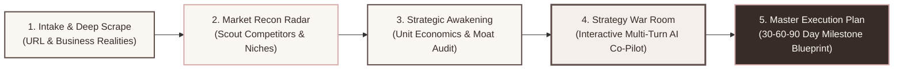
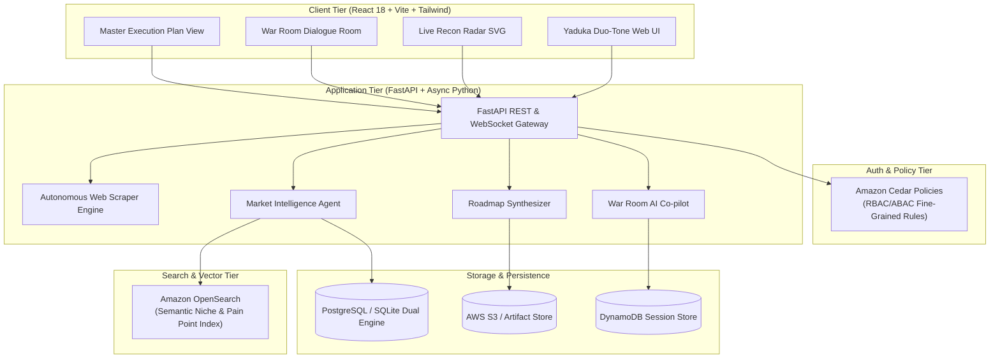

<div align="center">

# 🏔️ YADUKA
### *The Strategic Growth Expedition for Ambitious Startups*

**An Autonomous Market Reconnaissance & Strategy War Room Engine**  
*Built for the AWS Hackathon (17 Sept – 19 Sept 2026)*

[](LICENSE)
[-orange.svg)](aws/template.yaml)
[-green.svg)](aws/template.yaml)
[](backend/run.py)
[](src/App.jsx)

</div>

---

## 🎯 Executive Summary & Hackathon Tracks Alignment

**Yaduka** solves the fatal flaw killing 90% of early-stage startups and small businesses: **burning their marketing runway on blind ad spend**. Instead of throwing capital at unvalidated campaigns, Yaduka absorbs the founder's business reality, scours the competitive landscape for untapped customer niches, stress-tests positioning in an interactive AI Strategy War Room, and outputs an executable 30-60-90 day growth blueprint.

This project was architected from Day 1 to address the **Two Main Tracks** of the AWS Hackathon:

| Hackathon Requirement | Track 1: **BUILD IT** (Open Source / Local)<br/>*No AWS account, no credit card, no bill* | Track 2: **SHIP IT** (Deployed / Cloud)<br/>*Cloud-ready, up to $200 free tier* |
| :--- | :--- | :--- |
| **Agents and AI** | **Strands Agents SDK** multi-agent loop with local LLM orchestration | **SageMaker AI** & Bedrock foundation model endpoints |
| **Containers & K8s** | **Finch** CLI container engine (`Dockerfile.backend`, `Dockerfile.frontend`) | **ECS Fargate** & **EKS** container clusters |
| **Serverless** | **SAM CLI** (`aws/template.yaml`) + **LocalStack** (`aws/docker-compose.localstack.yml`) | **AWS Lambda**, **API Gateway HTTP APIs**, **Step Functions** |
| **Servers & Runtimes** | **Amazon Corretto** / Python runtime with **Firecracker** lightweight isolation | **AWS App Runner**, **EC2**, **Amplify Hosting** |
| **Data and Search** | **OpenSearch** (`backend/app/services/opensearch_service.py`) for semantic market clustering | **Amazon S3** (artifact storage), **DynamoDB** (sessions), **Aurora/RDS** (PostgreSQL) |
| **Auth and Policy** | **Cedar Policy Engine** (`aws/cedar/policies.cedar`, `backend/app/core/cedar_policy.py`) | **Amazon Cognito** user pool & federated identity |
| **The Plumbing** | Local asynchronous event dispatcher | **CloudFront**, **EventBridge**, **SQS**, **SNS**, **CloudWatch** |

---

## 🧭 The Yaduka 5-Stage Expedition Doctrine



1. **Autonomous Ingestion**: Founders input their website URL or business profile. Yaduka's autonomous scraper parses value propositions, metadata, offerings, and audience signals.
2. **Reconnaissance Radar**: Explores competitor terrain, identifying 3+ untapped customer niches and quantifying potential ad spend waste before launch.
3. **Strategic Awakening**: Diagnoses unit economics, customer lifetime value (LTV), customer acquisition cost (CAC), and channel vulnerabilities.
4. **Strategy War Room**: A live, multi-turn tactical co-pilot that interviews the founder, validates positioning, and reaches consensus on strategic levers.
5. **Master Execution Plan**: Synthesizes a structured 30-60-90 day tactical roadmap with step-by-step milestones, KPI benchmarks, and contingency playbooks.

---

## 🏛️ System Architecture



---

## 🚀 Quick Start Guide

### 1. Local Development (Native Python & Node)

#### Prerequisites:
- Python 3.10+ (Python 3.11 recommended)
- Node.js 18+ (Node 20+ recommended)

#### Step 1: Start Backend
```bash
# Navigate to backend and install requirements
cd backend
pip install -r requirements.txt

# Start FastAPI server (defaults to port 8000)
python run.py
```
- API Base: `http://127.0.0.1:8000`
- Swagger Interactive Docs: `http://127.0.0.1:8000/docs`
- Health Check: `http://127.0.0.1:8000/api/health`

#### Step 2: Start Frontend
```bash
# In project root
npm install
npm run dev
```
- Frontend UI: `http://localhost:3000`

---

### 2. Zero-Cost AWS Emulation (Track 1: LocalStack & OpenSearch)

To test the complete serverless architecture locally with **zero AWS billing**:

```bash
# Launch LocalStack and OpenSearch
docker-compose -f aws/docker-compose.localstack.yml up -d

# Verify LocalStack health
curl http://localhost:4566/_localstack/health
```

---

### 3. Containerized Deployment (Finch or Docker)

```bash
# Build and run the entire stack with a single command:
docker-compose up --build
```
Or with **AWS Finch**:
```bash
finch compose up --build
```

---

## 🔒 Fine-Grained Authorization with Cedar

Yaduka implements **Amazon Cedar** policies located at [`aws/cedar/policies.cedar`](aws/cedar/policies.cedar):

```cedar
// Sample Cedar Policy: Founder Authorization
permit (
  principal in Role::"Founder",
  action in [
    Action::"ViewProfile",
    Action::"TriggerReconSweep",
    Action::"InitiateWarRoom",
    Action::"GenerateMasterPlan"
  ],
  resource is BusinessProfile
)
when {
  principal.businessId == resource.businessId
};

// System Guardrail: Forbid reconnaissance against unverified/flagged domains
forbid (
  principal,
  action == Action::"TriggerReconSweep",
  resource is BusinessProfile
)
unless {
  resource.isFlagged == false && resource.isVerifiedDomain == true
};
```

---

## 📅 Hackathon Development Timeline (17 Sept – 19 Sept 2026)

- **Day 1 (17 Sept 2026)**: Inception, workspace foundation, Cedar policy architecture, FastAPI backend scaffold, and React duo-tone UI design system.
- **Day 2 (18 Sept 2026)**: Autonomous website scraper, LLM reasoning co-pilot, market reconnaissance analyzer, Strategy War Room dialogue engine, and 30-60-90 day roadmap synthesizer.
- **Day 3 (19 Sept 2026)**: AWS SAM serverless templates, LocalStack compose configuration, OpenSearch semantic indexing, hackathon documentation, and v1.0.0 release.

---

<div align="center">
<strong>YADUKA — Strategic Growth Expedition Engine</strong><br/>
<em>"When you reach your first level of success, the climb doesn’t end. It awards you the happiness of victory, followed immediately by the thrill of higher, steeper mountains."</em>
</div>
